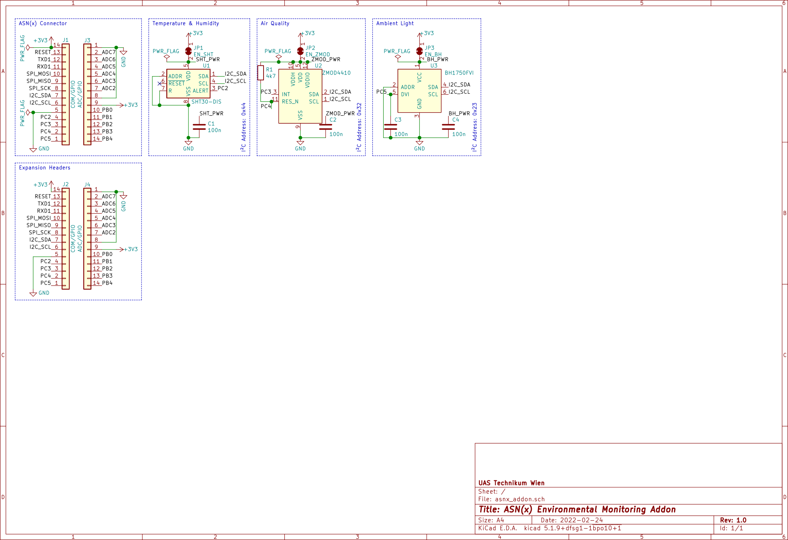
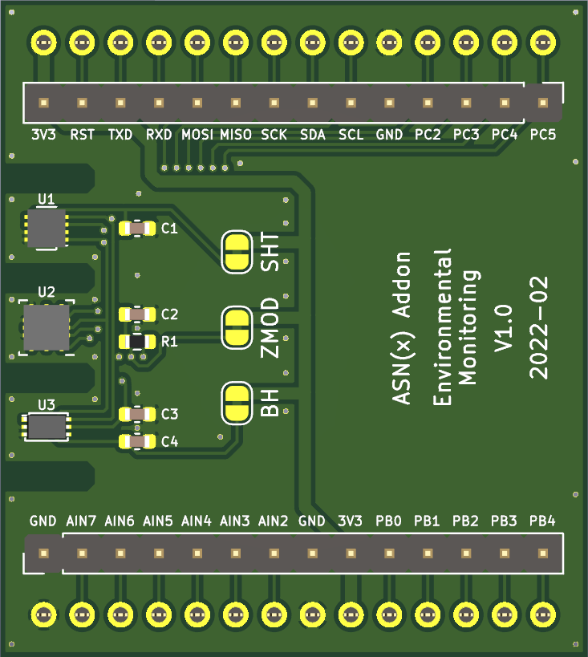

# ASN(x) Addon Template - PCB Design

The board was designed with KiCad `version 5.1.9` and only uses schematic symbols and PCB footprints available in the [KiCad libraries](https://kicad.org/libraries/download/).


## Contents

```
kicad/
├── avr_sensor_node.kicad_pcb       : PCB layout file
├── avr_sensor_node.ods             : BOM (created with LibreOffice Calc version 7.1.1.2)
├── avr_sensor_node.pro             : KiCad project file
├── avr_sensor_node.sch             : schematic layout file
├── fp-lib-table                    : project-specific footprint library list
├── mycomponents.dcm                : custom schematic library (descriptions, aliases and keywords)
├── mycomponents.lib                : custom schematic library
├── myfootprint.pretty              : custom PCB footprints
│   ├── BatteryHolder_Keystone_2462_2xAA-modified.kicad_mod
│   ├── L_Coilcraft_LPS3015.kicad_mod
│   └── XBEE-20_THT.kicad_mod
└── sym-lib-table                   : project-specific symbol library list
```


## Schematic

**Main schematic**:  



## PCB Design
 


For the PCB design the following rules were used:
* Design rules:
    * Minimum track width: `0.15 mm`
    * Minimum via diameter: `0.6 mm`
    * Minimum via drill: `0.3 mm`
    * Minimum hole to hole: `0.25 mm`
    * `Prohibit overlapping courtyards`
* Tracks:
    * `0.2 mm`
    * `0.25 mm`
    * `0.4 mm`
    * `0.8 mm`
* Vias:
    * Size: `0.6 mm`
    * Drill: `0.3 mm`
* Zones:
    * Clearance: `0.3 mm`
    * Minimum width: `0.18 mm`
    * Pad connections: `Thermal reliefs`
    * Thermal clearance: `0.18 mm`
    * Thermal spoke width: `0.8 mm`
