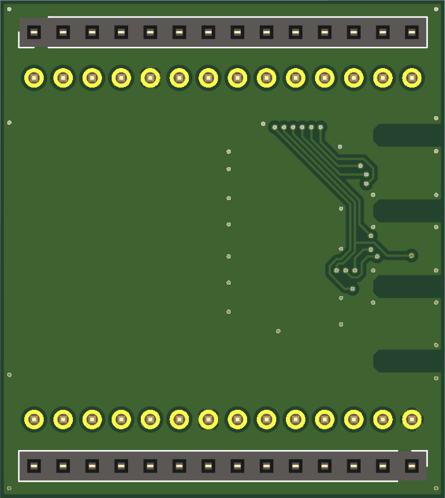

# ASN(x) Addon Template - PCB Design

The board was designed with KiCad `version 5.1.9` and only uses schematic symbols and PCB footprints available in the [KiCad libraries](https://kicad.org/libraries/download/).


## Contents

```
kicad/
├── 3dshapes                        : 3D models of PCB parts
├── my_footprints.pretty            : custom PCB footprints
├── bom                             : interactive HTML BOM
├── asnx_addon.kicad_pcb            : PCB layout file
├── asnx_addon.pro                  : KiCad project file
├── asnx_addon.sch                  : schematic layout file
├── fp-lib-table                    : project-specific footprint library list
├── my_components.dcm               : custom schematic library (descriptions, aliases and keywords)
├── my_components.lib               : custom schematic library
└── sym-lib-table                   : project-specific symbol library list
```


## Schematic

**Schematic**:  


## PCB Design
 
Front:  


Back:  


For the PCB design the following rules were used:
* Design rules:
    * Minimum track width: `0.15 mm`
    * Minimum via diameter: `0.6 mm`
    * Minimum via drill: `0.3 mm`
    * Minimum hole to hole: `0.25 mm`
    * `Prohibit overlapping courtyards`
* Tracks:
    * `0.2 mm`
    * `0.25 mm`
    * `0.4 mm`
    * `0.8 mm`
* Vias:
    * Size: `0.6 mm`
    * Drill: `0.3 mm`
* Zones:
    * Clearance: `0.3 mm`
    * Minimum width: `0.18 mm`
    * Pad connections: `Thermal reliefs`
    * Thermal clearance: `0.18 mm`
    * Thermal spoke width: `0.8 mm`
